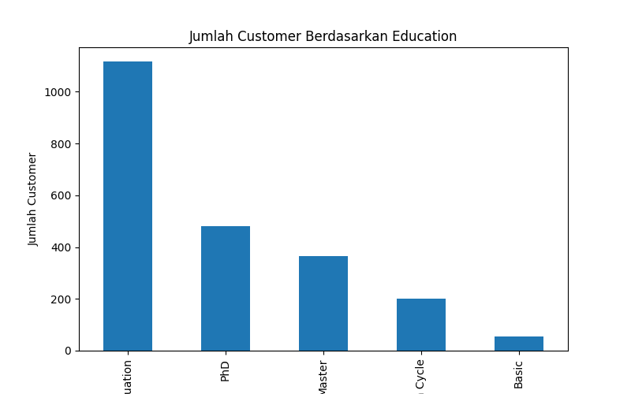
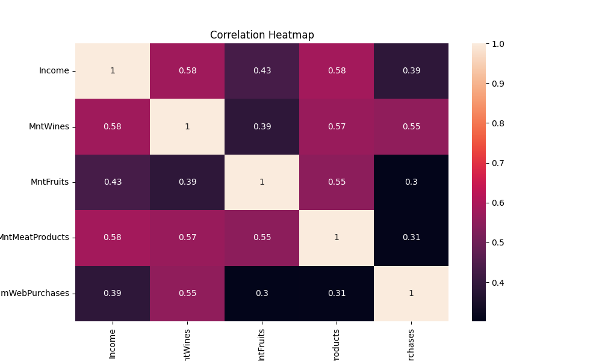
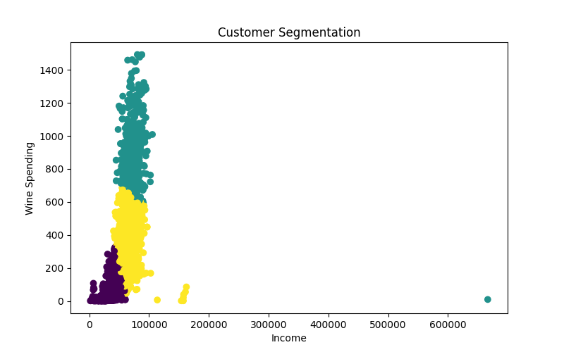

# Marketing Campaign Analysis Project

Proyek ini bertujuan untuk menganalisis perilaku pelanggan berdasarkan dataset kampanye pemasaran. Analisis ini sangat penting bagi perusahaan untuk memahami siapa pelanggan mereka, bagaimana pola pengeluaran mereka, dan bagaimana cara menargetkan mereka secara lebih efektif melalui segmentasi berbasis data.

## Deskripsi Dataset
Dataset ini berisi profil pelanggan yang mencakup:
- **Demografi**: Pendidikan (`Education`), Status Pernikahan, Pendapatan Tahunan (`Income`).
- **Produk**: Jumlah yang dihabiskan untuk berbagai produk seperti Anggur (`Wines`), Buah (`Fruits`), Daging (`Meat`), dll.
- **Saluran Pembelian**: Jumlah pembelian melalui Web, Katalog, atau Toko.

## Langkah-langkah Analisis
1.  **Preprocessing Data**: Mengidentifikasi dan menangani nilai yang hilang (*missing values*) untuk memastikan kualitas data yang akan dianalisis.
2.  **Exploratory Data Analysis (EDA)**: Melakukan visualisasi untuk melihat distribusi demografi dan korelasi antar variabel keuangan.
3.  **Customer Segmentation (Modeling)**: Menggunakan algoritma **K-Means Clustering** untuk mengelompokkan pelanggan berdasarkan pendapatan dan pengeluaran untuk produk Wine. Ini membantu dalam mengidentifikasi kelompok pelanggan bernilai tinggi.

## Hasil Analisis & Visualisasi

### 1. Distribusi Tingkat Pendidikan Customer
Visualisasi ini memberikan gambaran tentang latar belakang pendidikan pelanggan.
- **Insight**: Mayoritas pelanggan memiliki latar belakang "Graduation", diikuti oleh PhD dan Master. Ini menunjukkan target audiens perusahaan cenderung merupakan kelompok berpendidikan tinggi.



### 2. Matriks Korelasi (Heatmap)
Menunjukkan hubungan statistik antara pendapatan dan berbagai kategori pengeluaran serta saluran pembelian.
- **Insight**: Kita dapat melihat korelasi positif yang kuat antara `Income` dan pengeluaran untuk `Wines` serta `MeatProducts`, yang berarti pelanggan dengan pendapatan lebih tinggi cenderung menghabiskan lebih banyak uang pada kategori tersebut.



### 3. Segmentasi Pelanggan (Income vs Wine Spending)
Hasil dari pengelompokan menggunakan K-Means (k=3).
- **Cluster 0**: Pelanggan dengan pendapatan rendah dan pengeluaran rendah.
- **Cluster 1**: Pelanggan dengan pendapatan menengah dan pengeluaran moderat.
- **Cluster 2**: Pelanggan dengan pendapatan tinggi dan pengeluaran tinggi (Kelompok Premium).
- **Strategi**: Tim marketing dapat fokus pada Cluster 2 untuk produk eksklusif dan memberikan promosi menarik bagi Cluster 0 untuk meningkatkan loyalitas.



## Cara Menjalankan Proyek
Pastikan Anda memiliki lingkungan Python yang siap dengan library berikut:
```bash
pip install pandas matplotlib seaborn scikit-learn
```

Jalankan skrip utama:
```bash
python marketing_campaign.py
```

Setelah dijalankan, skrip akan secara otomatis menghasilkan file gambar PNG di direktori utama yang digunakan sebagai referensi dalam dokumentasi ini.
